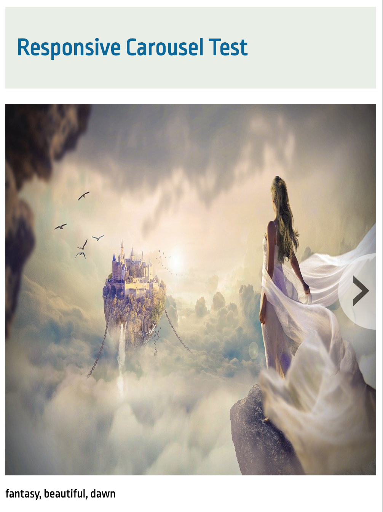
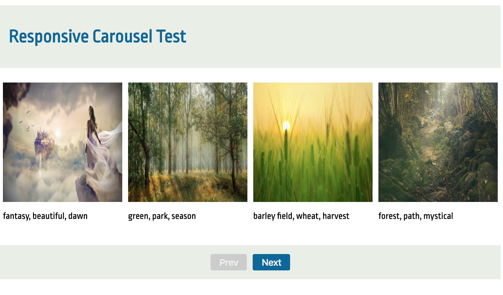

# Vue Carousel

# Responsive Vue Carousel

Demo available here: [Vue Carousel](http://wexsl.com/github/vue-carousel/)

Resize the browser to perform responsive tests




## Project setup
```
yarn install
```

### Compiles and hot-reloads for development
```
yarn serve
```

### Compiles and minifies for production
```
yarn build
```

### Run your unit tests (TODO)
```
yarn test:unit
```

### Lints and fixes files
```
yarn lint
```

### Customize configuration
See [Configuration Reference](https://cli.vuejs.org/config/).
